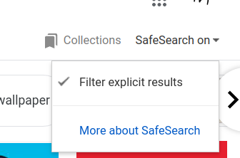

You know how you can filter out all the good stuff with google image search

But what if you **only** want the good stuff?

# Usage

`pip install -r requirements.txt`


- Register Google Search API utilities on [DataForSeo.com](dataforseo.com) (not affiliated, I hate it)

- Set `DFS_USERNAME` `DFS_PASSWORD` environment variables

- Sample Code:

```python
>>> unsafe_searcher = UnsafeSearcher()
>>> unsafe_searcher.get_funky(keyword="belle delphine")

task posted
waiting for tasks to finish...
polling...
Successfully harvested 354 funky images
Downloading...
```

